---
## Front matter
title: "Отчёт по лабораторной работе 7"
subtitle: "Архитектура компьютера"
author: "Соловьев Серафим"

## Generic otions
lang: ru-RU
toc-title: "Содержание"

## Bibliography
bibliography: bib/cite.bib
csl: pandoc/csl/gost-r-7-0-5-2008-numeric.csl

## Pdf output format
toc: true # Table of contents
toc-depth: 2
lof: true # List of figures
lot: true # List of tables
fontsize: 12pt
linestretch: 1.5
papersize: a4
documentclass: scrreprt
## I18n polyglossia
polyglossia-lang:
  name: russian
  options:
	- spelling=modern
	- babelshorthands=true
polyglossia-otherlangs:
  name: english
## I18n babel
babel-lang: russian
babel-otherlangs: english
## Fonts
mainfont: PT Serif
romanfont: PT Serif
sansfont: PT Sans
monofont: PT Mono
mainfontoptions: Ligatures=TeX
romanfontoptions: Ligatures=TeX
sansfontoptions: Ligatures=TeX,Scale=MatchLowercase
monofontoptions: Scale=MatchLowercase,Scale=0.9
## Biblatex
biblatex: true
biblio-style: "gost-numeric"
biblatexoptions:
  - parentracker=true
  - backend=biber
  - hyperref=auto
  - language=auto
  - autolang=other*
  - citestyle=gost-numeric
## Pandoc-crossref LaTeX customization
figureTitle: "Рис."
tableTitle: "Таблица"
listingTitle: "Листинг"
lofTitle: "Список иллюстраций"
lotTitle: "Список таблиц"
lolTitle: "Листинги"
## Misc options
indent: true
header-includes:
  - \usepackage{indentfirst}
  - \usepackage{float} # keep figures where there are in the text
  - \floatplacement{figure}{H} # keep figures where there are in the text
---

# Цель работы

Целью работы является изучение команд условного и безусловного переходов. Приобретение навыков написания программ с использованием переходов. Знакомство с назначением и структурой файла листинга.

# Выполнение лабораторной работы

Я организовал папку для работы над седьмой лабораторной и создал файл с исходным кодом lab7-1.asm.

В NASM команда jmp применяется для безусловного перехода. Изучил пример кода с этой командой и внёс его в файл lab7-1.asm.

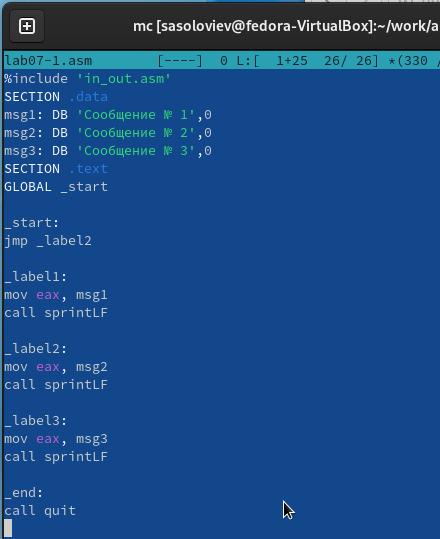{ #fig:001 width=70%, height=70% }

Скомпилировал и запустил полученную программу.

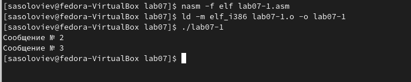{ #fig:002 width=70%, height=70% }

Команда jmp позволяет переходить как вперёд, так и назад в коде. Модифицировал программу так, чтобы она сначала показывала "Сообщение № 2", а потом "Сообщение № 1", и после этого завершалась. Это было достигнуто добавлением команды jmp с меткой _label1 после "Сообщения № 2" для перехода к выводу "Сообщения № 1", и команды jmp с меткой _end после "Сообщения № 1" для завершения работы через вызов функции quit.

Внёс изменения в код, соответствующие листингу 7.2.

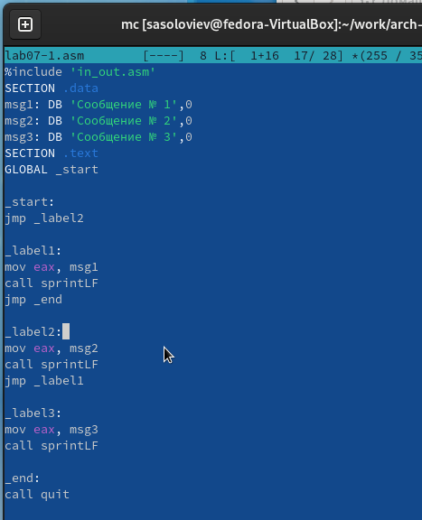{ #fig:003 width=70%, height=70% }

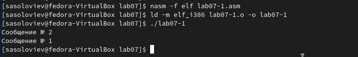{ #fig:004 width=70%, height=70% }

Программа была переписана с изменёнными командами jmp для изменения порядка вывода.

```
Сообщение № 3
Сообщение № 2
Сообщение № 1
```

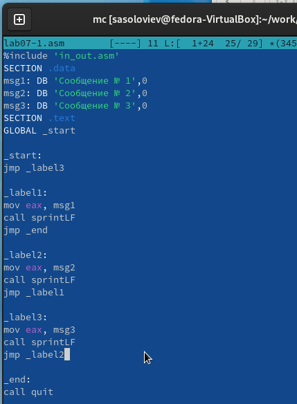{ #fig:005 width=70%, height=70% }

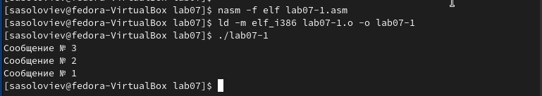{ #fig:006 width=70%, height=70% }

Команда jmp всегда приводит к переходу. Однако в программировании часто требуются условные переходы, когда переход выполняется только при определённом условии.

Рассмотрим программу, которая вычисляет и выводит наибольшее из трёх чисел: A, B и C. Значения A и C заданы в коде, а значение B вводится пользователем.

Скомпилировал программу и провёл тестирование с различными вводимыми значениями B.

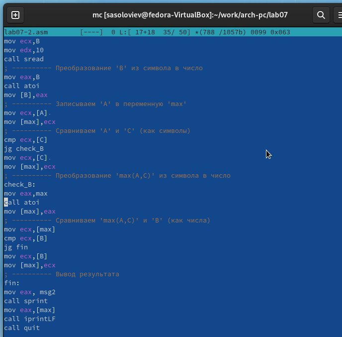{ #fig:007 width=70%, height=70% }

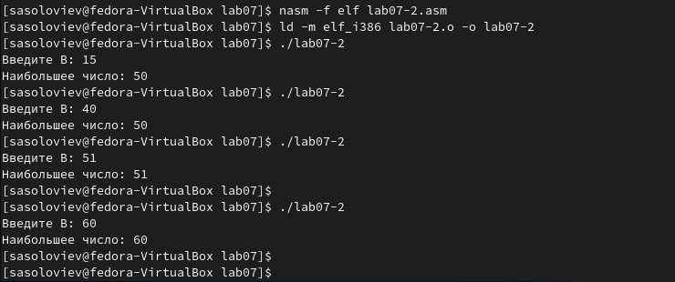{ #fig:008 width=70%, height=70% }

Обычно при компиляции с помощью nasm получается лишь объектный файл. Однако, чтобы сформировать файл листинга, следует использовать опцию -l и определить имя файла листинга через командную строку.

Сформировал листинг для кода, находящегося в lab7-2.asm.

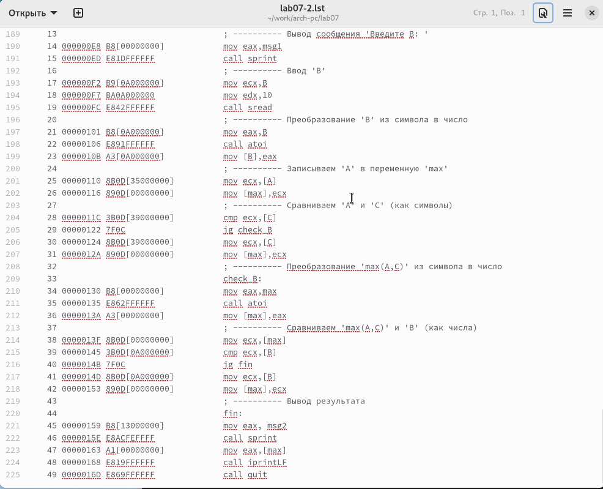{ #fig:009 width=70%, height=70% }

Я внимательно ознакомился с форматом и содержимым файла листинга. 
Подробно объясню содержимое трёх строк из этого файла.

**строка 213**

- 38 - номер строки в подпрограмме

- 0000013F - адрес

- 8B0D[00000000] - машинный код

- mov ecx,[max] - код программы - копирует MAX в ecx

**строка 214**

- 39 - номер строки в подпрограмме

- 00000145 - адрес

- 3B0D[0A000000] - машинный код

- cmp ecx,[B] - код программы - сравнивает ecx и B

**строка 215**

- 40 - номер строки в подпрограмме

- 0000014B - адрес

- 7F0C - машинный код

- jg fin - код программы - если больше перейти к метке fin

Затем я открыл исходный код в lab7-2.asm и удалил один операнд из команды, содержащей два операнда. После этого произвел компиляцию с целью создания файла листинга.

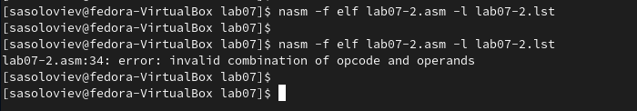{ #fig:010 width=70%, height=70% }

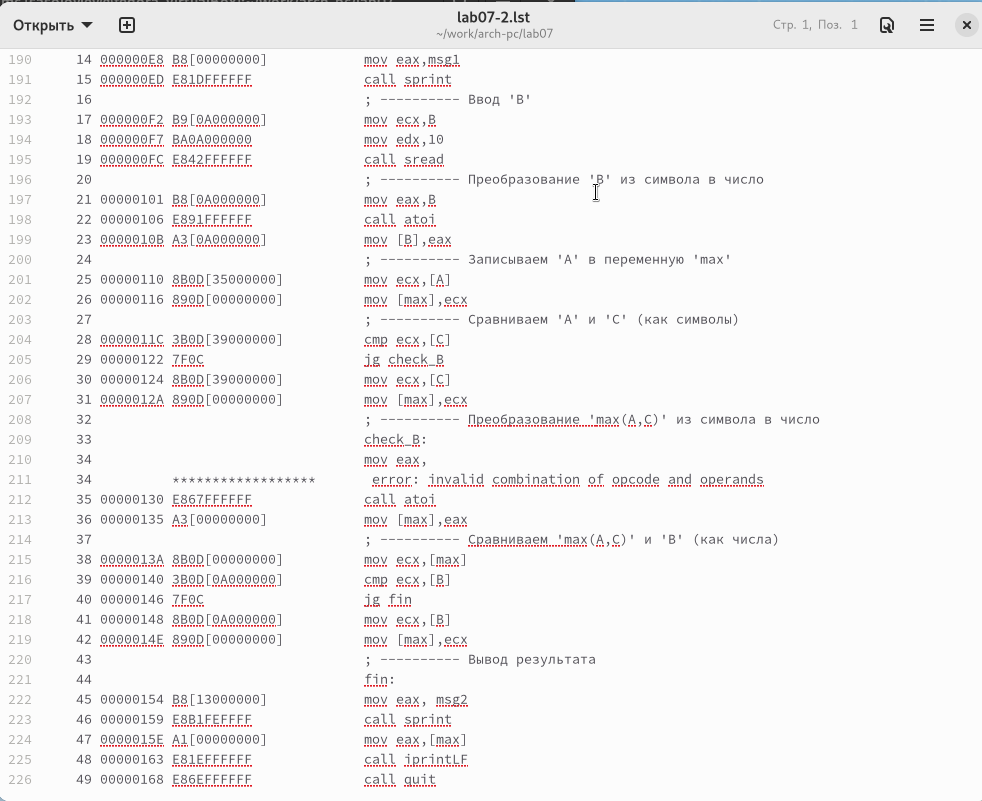{ #fig:011 width=70%, height=70% }

В итоге из-за синтаксической ошибки не удалось сгенерировать объектный файл, но был получен листинг программы, где было указано место возникновения ошибки.

## Задание для самостоятельной работы

Напишите программу нахождения наименьшей из 3 целочисленных переменных a,b и c. 
Значения переменных выбрать из табл. 7.5 в соответствии с вариантом, полученным при выполнении лабораторной работы № 6.
Создайте исполняемый файл и проверьте его работу

Мой вариант 18 - числа: 83,73,30

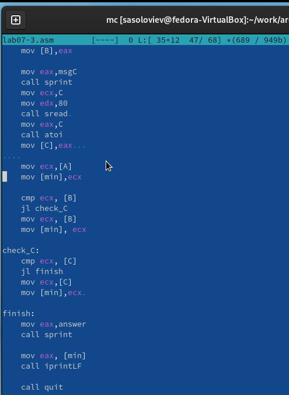{ #fig:012 width=70%, height=70% }

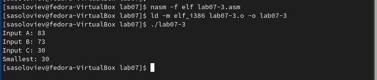{ #fig:013 width=70%, height=70% }

Напишите программу, которая для введенных с клавиатуры значений x и a вычисляет значение заданной функции f(x) и выводит результат вычислений. 
Вид функции f(x) выбрать из таблицы 7.6 вариантов заданий в соответствии с вариантом, полученным при выполнении лабораторной работы № 7. 
Создайте исполняемый файл и проверьте его работу для значений X и a из 7.6.

Мой вариант 18

$$
 \begin{cases}
	a^2, a \ne 1
	\\   
	10+x, a = 1
 \end{cases}
$$

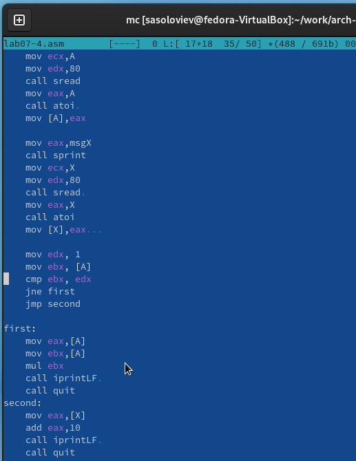{ #fig:014 width=70%, height=70% }

При $x=1, a=2 f(x)=4$

При $x=2, a=1 f(x)=12$

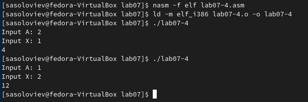{ #fig:015 width=70%, height=70% }

# Выводы

Изучили команды условного и безусловного переходов, познакомились с фалом листинга.