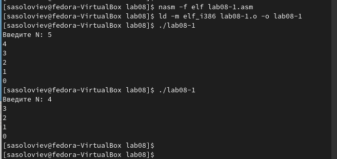
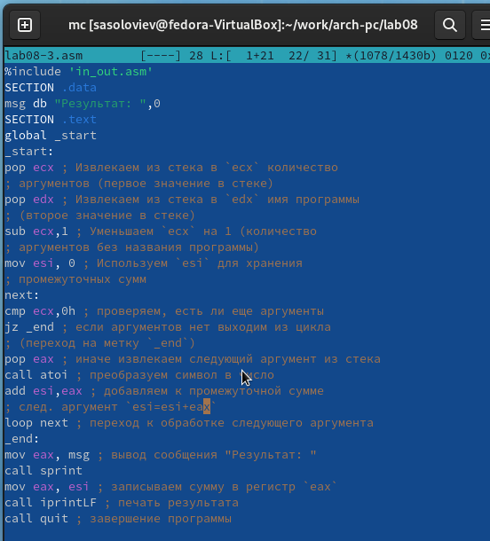
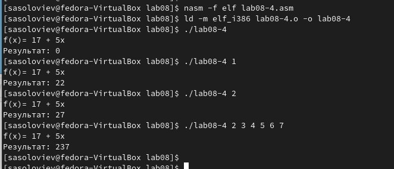

---
## Front matter
title: "Отчёт по лабораторной работе 8"
subtitle: "Архитектура компьютера"
author: "Соловьев Серафим"

## Generic otions
lang: ru-RU
toc-title: "Содержание"

## Bibliography
bibliography: bib/cite.bib
csl: pandoc/csl/gost-r-7-0-5-2008-numeric.csl

## Pdf output format
toc: true # Table of contents
toc-depth: 2
lof: true # List of figures
lot: true # List of tables
fontsize: 12pt
linestretch: 1.5
papersize: a4
documentclass: scrreprt
## I18n polyglossia
polyglossia-lang:
  name: russian
  options:
	- spelling=modern
	- babelshorthands=true
polyglossia-otherlangs:
  name: english
## I18n babel
babel-lang: russian
babel-otherlangs: english
## Fonts
mainfont: PT Serif
romanfont: PT Serif
sansfont: PT Sans
monofont: PT Mono
mainfontoptions: Ligatures=TeX
romanfontoptions: Ligatures=TeX
sansfontoptions: Ligatures=TeX,Scale=MatchLowercase
monofontoptions: Scale=MatchLowercase,Scale=0.9
## Biblatex
biblatex: true
biblio-style: "gost-numeric"
biblatexoptions:
  - parentracker=true
  - backend=biber
  - hyperref=auto
  - language=auto
  - autolang=other*
  - citestyle=gost-numeric
## Pandoc-crossref LaTeX customization
figureTitle: "Рис."
tableTitle: "Таблица"
listingTitle: "Листинг"
lofTitle: "Список иллюстраций"
lotTitle: "Список таблиц"
lolTitle: "Листинги"
## Misc options
indent: true
header-includes:
  - \usepackage{indentfirst}
  - \usepackage{float} # keep figures where there are in the text
  - \floatplacement{figure}{H} # keep figures where there are in the text
---

# Цель работы

Целью работы является приобретение навыков написания программ с использованием циклов и обработкой аргументов командной строки..

# Выполнение лабораторной работы

## Реализация циклов в NASM

Был организован каталог для выполнения лабораторного задания №8, в котором также был сформирован файл с наименованием lab8-1.asm.

Когда вы используете команду loop в NASM для создания циклических структур, важно учитывать, что она использует регистр ecx как счетчик, автоматически декрементируя его на один с каждым проходом цикла.
Для наглядности рассмотрим пример кода, который демонстрирует значение регистра ecx.

В файл lab8-1.asm был введен код из примера 8.1.
После этого была собрана исполняемая версия и проведена ее проверка.

{ #fig:001 width=70%, height=70% }

{ #fig:002 width=70%, height=70% }

В данном случае видно, что использование регистра ecx в команде loop может стать причиной ошибочного поведения программы. Я изменил код, изменив обработку значения регистра ecx во время цикла.

Теперь программа входит в бесконечный цикл, если N нечетное, и выводит только нечетные числа, если N четное.

{ #fig:003 width=70%, height=70% }

{ #fig:004 width=70%, height=70% }

Для корректного использования регистра ecx в цикле и обеспечения правильной работы программы можно применить стек. Я модифицировал код, добавив инструкции push и pop, чтобы сохранить значение счетчика цикла loop в стеке.

Была сформирована исполняемая версия и осуществлена ее проверка. Программа отображает числа от N-1 до 0, где число итераций соответствует величине N.

{ #fig:005 width=70%, height=70% }

{ #fig:006 width=70%, height=70% }

Я создал файл с именем lab8-2.asm в папке ~/work/arch-pc/lab08 и занес в него код, взятый из примера 8.2.

После этого я собрал исполняемый файл из исходного кода и запустил его с параметрами. В итоге программа успешно обработала пять переданных ей параметров. Под параметрами понимаются элементы, разделяемые пробелами, которые могут быть текстом или числами.

{ #fig:007 width=70%, height=70% }

{ #fig:008 width=70%, height=70% }

Теперь давайте рассмотрим другой пример программы, задачей которой является вывод на экран суммы чисел, передаваемых в неё в качестве параметров.

{ #fig:009 width=70%, height=70% }

{ #fig:010 width=70%, height=70% }

Я внес изменения в код из примера 8.3 таким образом, чтобы программа теперь вычисляла произведение значений, переданных через командную строку.

{ #fig:011 width=70%, height=70% }

{ #fig:012 width=70%, height=70% }

## Задание для самостоятельной работы

Напишите программу, которая находит сумму значений функции 
$f(x)$ для $x = x_1, x_2, ..., x_n$, т.е. программа должна выводить значение 
$f(x_1) + f(x_2)+ ... +f(x_n)$. 
Значения $x$ передаются как аргументы. 
Вид функции $f(x)$ выбрать из таблицы 8.1 вариантов заданий в соответствии с вариантом, 
полученным при выполнении лабораторной работы № 7. 
Создайте исполняемый файл и проверьте его работу на нескольких наборах $x$.

Мой вариант 18: $f(x) = 17 + 5x$ 

{ #fig:013 width=70%, height=70% }

Для проверки я запустил сначала с одним аргументом. Так, при подстановке $f(1)=22, f(2)=27$

Затем подал несколько аргументов и получил сумму значений функции.

{ #fig:014 width=70%, height=70% }

# Выводы

Освоили работы со стеком, циклом и аргументами на ассемблере nasm.