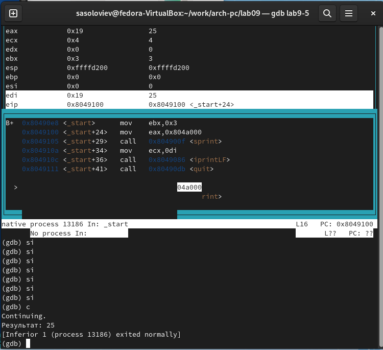

---
## Front matter
title: "Отчёт по лабораторной работе 9"
subtitle: "Архитектура компьютера"
author: "Соловьев Серафим"

## Generic otions
lang: ru-RU
toc-title: "Содержание"

## Bibliography
bibliography: bib/cite.bib
csl: pandoc/csl/gost-r-7-0-5-2008-numeric.csl

## Pdf output format
toc: true # Table of contents
toc-depth: 2
lof: true # List of figures
lot: true # List of tables
fontsize: 12pt
linestretch: 1.5
papersize: a4
documentclass: scrreprt
## I18n polyglossia
polyglossia-lang:
  name: russian
  options:
	- spelling=modern
	- babelshorthands=true
polyglossia-otherlangs:
  name: english
## I18n babel
babel-lang: russian
babel-otherlangs: english
## Fonts
mainfont: PT Serif
romanfont: PT Serif
sansfont: PT Sans
monofont: PT Mono
mainfontoptions: Ligatures=TeX
romanfontoptions: Ligatures=TeX
sansfontoptions: Ligatures=TeX,Scale=MatchLowercase
monofontoptions: Scale=MatchLowercase,Scale=0.9
## Biblatex
biblatex: true
biblio-style: "gost-numeric"
biblatexoptions:
  - parentracker=true
  - backend=biber
  - hyperref=auto
  - language=auto
  - autolang=other*
  - citestyle=gost-numeric
## Pandoc-crossref LaTeX customization
figureTitle: "Рис."
tableTitle: "Таблица"
listingTitle: "Листинг"
lofTitle: "Список иллюстраций"
lotTitle: "Список таблиц"
lolTitle: "Листинги"
## Misc options
indent: true
header-includes:
  - \usepackage{indentfirst}
  - \usepackage{float} # keep figures where there are in the text
  - \floatplacement{figure}{H} # keep figures where there are in the text
---

# Цель работы

Целью работы является приобретение навыков написания программ с использованием подпрограмм.
Знакомство с методами отладки при помощи GDB и его основными возможностями.

# Выполнение лабораторной работы

Я организовал папку для проведения лабораторного занятия № 9 и переместился в неё. После этого я создал файл с именем lab9-1.asm.

Давайте рассмотрим в качестве примера программу, задачей которой является расчёт арифметической формулы $f(x) = 2x+7$, используя для этого вспомогательную функцию calcul. В этом случае значение $x$ подаётся через клавиатуру, а расчёт формулы происходит внутри вспомогательной функции.

{ #fig:001 width=70%, height=70% }

{ #fig:002 width=70%, height=70% }

Затем я внес некоторые корректировки в код программы, включив дополнительную функцию subcalcul внутри calcul для расчёта формулы $f(g(x))$, при этом значение $x$ по-прежнему вводится через клавиатуру, а функции $f(x) = 2x + 7$ и $g(x) = 3x − 1$ обрабатываются внутри этих функций.

{ #fig:003 width=70%, height=70% }

{ #fig:004 width=70%, height=70% }

Кроме того, я подготовил файл lab9-2.asm, содержащий код программы из Примера 9.2, который демонстрирует программу для вывода сообщения "Hello world!" на экран.

{ #fig:005 width=70%, height=70% }

Я добавил отладочную информацию с помощью ключа '-g' для возможности работы с отладчиком GDB.

После этого я загрузил исполняемый файл в отладчик GDB и проверил функционирование программы, активировав её командой 'run' (или 'r').

{ #fig:006 width=70%, height=70% }

Для тщательного анализа программы я установил точку останова на метке 'start', с которой стартует исполнение любой программы на ассемблере, и запустил программу для наблюдения. После этого я осмотрел дизассемблированный код программы, чтобы понять её структуру и работу.

{ #fig:007 width=70%, height=70% }

{ #fig:008 width=70%, height=70% }

Чтобы проверить наличие брейкпоинта с меткой '_start', я применил команду 'info breakpoints' (или 'i b'). После этого я задал еще один брейкпоинт на адресе предпоследней команды 'mov ebx, 0x0'.

{ #fig:009 width=70%, height=70% }

Используя отладчик GDB, я мог наблюдать и редактировать содержимое памяти и регистров. Я выполнил пять шагов командой 'stepi' (или 'si'), следя за изменениями в регистрах.

{ #fig:010 width=70%, height=70% }

{ #fig:011 width=70%, height=70% }

Чтобы просмотреть значение переменной msg1, я воспользовался соответствующей командой для извлечения необходимой информации.

{ #fig:012 width=70%, height=70% }

Я также использовал команду 'set' для модификации значений в регистрах или ячейках памяти, указывая при этом нужный регистр или адрес. Мне удалось изменить первый символ переменной msg1.

{ #fig:013 width=70%, height=70% }

С помощью команды 'set' я изменил значение регистра ebx на требуемое.

{ #fig:014 width=70%, height=70% }

Я скопировал файл lab8-2.asm, созданный в рамках лабораторной работы №8, который содержит код программы для вывода аргументов командной строки, и сформировал из него исполняемый файл.

Для запуска программы с аргументами в GDB я использовал опцию --args, загрузив исполняемый файл с заданными аргументами в отладчик.

Я установил брейкпоинт перед выполнением первой команды программы и начал ее выполнение.

Адрес вершины стека, содержащий количество аргументов командной строки (включая название программы), находится в регистре ESP. По этому адресу расположено число, показывающее количество аргументов. В моем случае было видно, что их пять, включая название программы lab9-3 и аргументы: аргумент1, аргумент2 и 'аргумент 3'.

Я также осмотрел другие записи стека. По адресу [ESP+4] расположен указатель на имя программы в памяти. Адреса первого, второго и последующих аргументов находятся по адресам [ESP+8], [ESP+12] и так далее, с шагом в 4 байта, поскольку каждый следующий адрес отстоит на 4 байта от предыдущего ([ESP+4], [ESP+8], [ESP+12]).

{ #fig:015 width=70%, height=70% }

## Задание для самостоятельной работы

Модифицировал код из восьмой лабораторной работы (Первое задание для индивидуального выполнения), создав подпрограмму для расчета значения функции f(x).

{ #fig:016 width=70%, height=70% }

{ #fig:017 width=70%, height=70% }

В представленном коде описан алгоритм для расчета формулы $(3+2)*4+5$. 
Однако его исполнение приводит к некорректному итогу. Я выявил это, наблюдая за изменениями в регистрах при помощи отладчика GDB.

{ #fig:018 width=70%, height=70% }

{ #fig:019 width=70%, height=70% }

Ошибка заключалась в неверном порядке аргументов команды add и в том, что в конце исполнения программы значение ebx переносится в edi вместо eax.

Исправленный код программы

{ #fig:020 width=70%, height=70% }

{ #fig:021 width=70%, height=70% }

# Выводы

Освоили работy с подпрограммами и отладчиком.