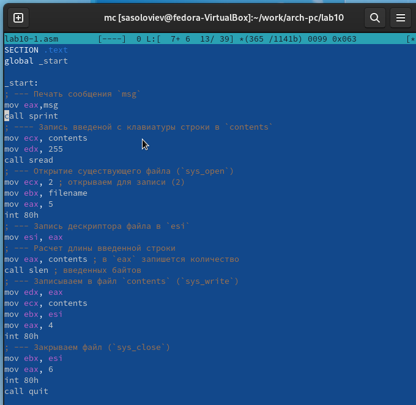
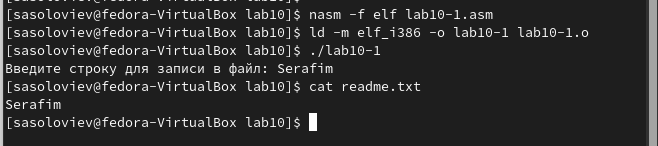
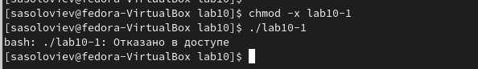
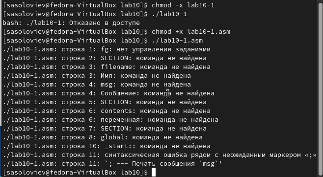
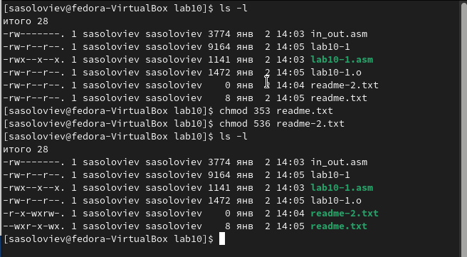
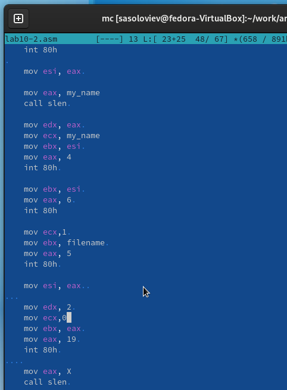
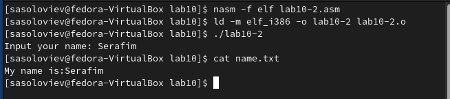

---
## Front matter
title: "Отчёт по лабораторной работе 10"
subtitle: "Архитектура компьютера"
author: "Соловьев Серафим"

## Generic otions
lang: ru-RU
toc-title: "Содержание"

## Bibliography
bibliography: bib/cite.bib
csl: pandoc/csl/gost-r-7-0-5-2008-numeric.csl

## Pdf output format
toc: true # Table of contents
toc-depth: 2
lof: true # List of figures
lot: true # List of tables
fontsize: 12pt
linestretch: 1.5
papersize: a4
documentclass: scrreprt
## I18n polyglossia
polyglossia-lang:
  name: russian
  options:
	- spelling=modern
	- babelshorthands=true
polyglossia-otherlangs:
  name: english
## I18n babel
babel-lang: russian
babel-otherlangs: english
## Fonts
mainfont: PT Serif
romanfont: PT Serif
sansfont: PT Sans
monofont: PT Mono
mainfontoptions: Ligatures=TeX
romanfontoptions: Ligatures=TeX
sansfontoptions: Ligatures=TeX,Scale=MatchLowercase
monofontoptions: Scale=MatchLowercase,Scale=0.9
## Biblatex
biblatex: true
biblio-style: "gost-numeric"
biblatexoptions:
  - parentracker=true
  - backend=biber
  - hyperref=auto
  - language=auto
  - autolang=other*
  - citestyle=gost-numeric
## Pandoc-crossref LaTeX customization
figureTitle: "Рис."
tableTitle: "Таблица"
listingTitle: "Листинг"
lofTitle: "Список иллюстраций"
lotTitle: "Список таблиц"
lolTitle: "Листинги"
## Misc options
indent: true
header-includes:
  - \usepackage{indentfirst}
  - \usepackage{float} # keep figures where there are in the text
  - \floatplacement{figure}{H} # keep figures where there are in the text
---

# Цель работы

Целью работы является приобретение навыков написания программ для работы с файлами.

# Выполнение лабораторной работы

Я организовал папку для хранения программ, относящихся к лабораторной № 10, и переместился в неё. В этой папке я создал файлы lab10-1.asm, readme-1.txt и readme-2.txt.

В файл lab10-1.asm я ввел код из примера 10.1, который описывает программу для записи текста в файл. Затем я скомпилировал этот код в исполняемый файл и провел тестирование его функционала.

{ #fig:001 width=70%, height=70% }

Разработанная мной программа запрашивает ввод текста пользователя и записывает его в файл readme.txt. В случае отсутствия данного файла, введённый текст не будет сохранён.

{ #fig:002 width=70%, height=70% }

При попытке запустить файл lab10-1, я столкнулся с проблемой: файл не исполнялся из-за отсутствия прав на выполнение.

{ #fig:003 width=70%, height=70% }

Я применил команду chmod для предоставления исполняемых прав файлу lab10-1.asm с кодом программы. После изменения прав я снова попробовал его выполнить.

Файл успешно запустился, но поскольку он содержал ассемблерные инструкции, а не команды оболочки, в терминале возникли ошибки.

{ #fig:004 width=70%, height=70% }

Кроме того, я настроил права доступа для файлов readme в соответствии с указаниями в таблице 10.4 и проверил корректность установленных прав с помощью команды ls -

Мой вариант 18: ```-wx r-x -wx``` и ```101 011 110```

{ #fig:005 width=70%, height=70% }

## Задание для самостоятельной работы

Написал программу работающую по следующему алгоритму:

* Вывод приглашения “Как Вас зовут?”

* ввести с клавиатуры свои фамилию и имя

* создать файл с именем name.txt

* записать в файл сообщение “Меня зовут”

* дописать в файл строку введенную с клавиатуры

* закрыть файл

{ #fig:006 width=70%, height=70% }

{ #fig:007 width=70%, height=70% }

# Выводы

Освоили работy с файлами и правами доступа.